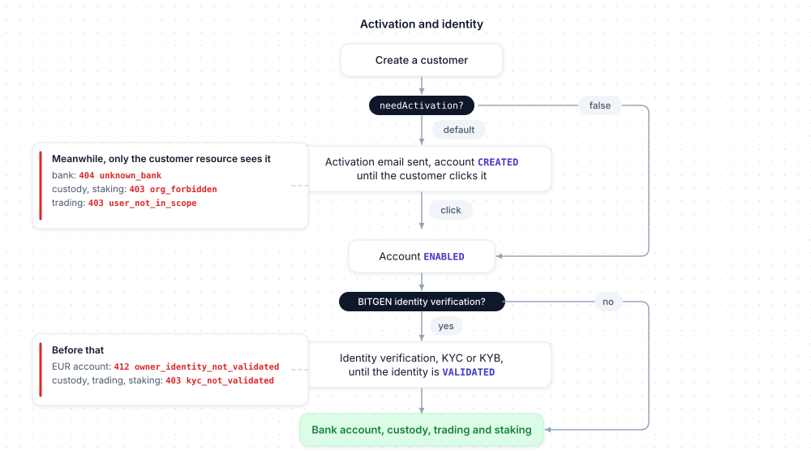

# Concepts

The conventions shared by every resource of the SDK: how a customer is designated, how amounts, pages, booleans, assets and dates travel, and which customers the financial resources accept. Examples use `client`, a configured `BitgenClient` ([Configuration](configuration.md)).

## User references

Wherever a method expects a customer, it takes a `UserRef`: a string — the customer's **uuid** — or one of the models that carry it. The SDK sends the uuid of the model: the `Created` returned by `client.customer.create`, a `Customer` of `client.customer.list`, an `Account` of `client.customer.get`, the `user` of an `Order`, the `owner` of a `Transaction` or of a `StakingMovement`.

```
type UserRef = string | Created | Customer | Account | UserSummary | OrderUser
```

```ts
await client.customer.get('CUSTOMER_UUID')
await client.customer.get(customer)   // the Created returned by client.customer.create
```

An email works too where the API resolves it (`customer`, `bank`, `custody`, `staking` — not `trading`, nor the `user` filter of the lists), but the uuid is cheaper for the API — prefer it. TypeScript checks the shape, not the origin: any object carrying a `uuid` string is accepted as a `UserRef`, a `Wallet` included — a uuid that is not a customer's is refused by the API, with the code of the resource called (`404 unknown_user`, `404 unknown_bank`, `403 org_forbidden`…).

The same goes for the other objects the SDK returns: wherever a method expects the uuid of an order, a movement, a position, a connector, a transaction, a subscription, an event of the catalogue or a key, it also takes the model itself (`client.staking.rewards(movement.staking)`, `client.trading.get(order)`) and sends its uuid — there, passing another model (a `StakingMovement` as a position, a `Wallet` as an order) is a type error in TypeScript.

## Amounts

The API handles crypto amounts as **strings** (up to 18 decimals): a JavaScript `number` only keeps about 15 significant digits and nothing on the server side restores what it lost. The SDK therefore:

- accepts an `Amount = string | number` and always sends it as a string — a string is sent as is, a number is converted with `String(n)`;
- rejects, with a `TypeError` and before any request, an empty string, a negative or non-finite number, and a number that `String()` would write in exponent notation (`1e-8`, `1e21`): pass those as strings;
- never rounds or reformats a string: `'0.000000000000000001'` reaches the API untouched.

**Prefer strings**, even for EUR. In responses, crypto quantities are strings (`Wallet.balance`, `Order.amount`, `StakingMovement.amount`) and EUR amounts are numbers with 2 decimals (`BankAccount.balance`, `BankOperation.amount`, `StakingPortfolio.balances`).

**Minimums.** Purchases, sales, on-chain withdrawals and staking movements have minimums — set by BITGEN per environment, subject to change, never hard-coded in the SDK. The API's answer is the source of truth: `416 invalid_amount` for a purchase or a sale, `416 withdraw_below_minimum` for an on-chain withdrawal, `422 amount_below_minimum` for a staking movement. For staking, the provider's minimums are readable in its configuration (`client.staking.providers()`, [Staking](resource/staking.md#providers)).

## Pagination

Paginated lists take `PageParams` and return a `Page`:

```ts
interface PageParams { offset?: number, limit?: number }   // limit: default 10, max 50
interface Page<T> { count: number, items: T[] }
```

`transaction.list` accepts a `limit` up to 100.

```ts
const { count, items } = await client.customer.list({ offset: 0, limit: 50 })
```

`client.core.list` is not paginated: its `count` is everything that matches.

## Query booleans

The boolean filters of the lists — `includeClosed` (`customer.list`), `includeRevoked` (`apikeys.list`), `includeArchived` (`webhooks.list`) — are sent as `true` / `false`. The API also reads `1` / `0`, treats an absent parameter as `false`, and answers `422 invalid_<param>` for any other value: `invalid_include_closed`, `invalid_include_revoked`, `invalid_include_archived`.

## Assets

Wherever an asset is expected, the SDK accepts its **uuid** or its **ISO code** as a string, in any case (the API normalizes it) — or an `Asset` / `AssetRef` model returned by the SDK, whose uuid is then sent. The `Asset` constants are the ISO codes of the main assets; any other code known to the catalogue ([Assets](resource/asset.md)) is passed as a plain string.

```ts
import { Asset } from '@bitgen/sdk'

Asset.BTC   // 'btc'
Asset.ETH   // 'eth'
Asset.USDC  // 'usdc'
Asset.XRP   // 'xrp'
Asset.SOL   // 'sol'

const eth = await client.asset.get(Asset.ETH)          // or by uuid
const wallet = await client.custody.wallet(customer, eth)   // the model: its uuid is sent
```

The `iso` the API returns has the case it is stored with (`ETH` today): **compare it case-insensitively**. In TypeScript, `Asset` is also the type of an asset returned by `client.asset`; `AssetInput` is the type of an asset argument (`string | Asset | AssetRef`).

## Constants

Every value the API enumerates is a **frozen object of string constants**, exported by the package with a type of the same name — `Env.SANDBOX` is `'sandbox'`, `Locale.FR` is `'FR'`, `TradingDirection.BUY` is `'buy'`, `AssetState.AVAILABLE` is `'AVAILABLE'`, `WebhookEventName.CUSTODY_SENT` is `'custody.sent'`. Inputs take the constant; outputs are strings you compare with the constants.

```ts
import { Asset, AssetState, Locale } from '@bitgen/sdk'

const eth = await client.asset.get(Asset.ETH)
if (eth.state === AssetState.AVAILABLE) {   // outputs are strings: compare them with the constants
  await client.customer.update(customer, { locale: Locale.EN })   // inputs take the constant
}
console.log(Object.values(Locale))   // [ 'FR', 'EN' ]
```

In TypeScript, an input that is not one of the values (`locale: 'en'`, `direction: 'Buy'`) is a compile-time error: the case matters. From JavaScript the string is sent as is, and the API's answer is the source of truth. An output the SDK does not know yet (a state the API added) is kept as is, as a string — `WebhookEventName` accepts any string, as the catalogue may grow.

## Timestamps and histories

Timestamps are **epochs in seconds** (`createdAt`, `updatedAt`, `date`, `expiresAt`…). Time series are a `History`:

```ts
type History = Record<'d' | 'w' | 'm' | 'y' | 'all', [number, number][]>
```

Each key is a list of `[epoch seconds, value]` points: `d` covers the last 24 hours with one point per hour, `w` and `m` one point per day, `y` and `all` one point per month; the last point is the current value. Histories are the EUR price of an asset (`client.asset`), the EUR balance of a bank account, the EUR value of a wallet or of a whole custody, and the capital and revenues of a staking portfolio.

## Activation and identity

By default `client.customer.create` sends the customer an activation email. Until they click it, the account stays `CustomerState.CREATED` (`setup.needActivation` is `true`) and the **financial resources do not see it**: `client.bank` answers `404 unknown_bank`, `client.custody` and `client.staking` `403 org_forbidden`, `client.trading` `403 user_not_in_scope`. Only `client.customer.list` (where the customer appears as `CREATED`) and `client.customer.get` see it. An organization that handles onboarding itself creates its customers with `needActivation: false` — usable right away, no BITGEN email — and `notify: false` for no BITGEN emails at all ([Customers › create](resource/customer.md#create)).

If your organization uses BITGEN's identity verification, the customer's identity (KYC for a person, KYB for a business) must be validated first — `412 owner_identity_not_validated` when reading the EUR account, `403 kyc_not_validated` on custody, trading and staking otherwise. An organization that verifies the identity of its customers by its own means has no such requirement. The verification itself is not part of the SDK; its state is `identity.state` ([Customers › Identity](resource/customer.md#identity)).



## Following a purchase and a sale

A purchase moves money across four resources. Placing the order reserves the EUR on the customer's bank account — an operation `PURCHASE` ([Bank accounts](resource/bank.md)); the exchange of the platform executes it — `EXECUTING`, then `FILLED` with the price, the fee and the quantity received ([Trading](resource/trading.md)); the quantity is delivered to the customer's custody wallet — `DELIVERING`, then `DONE` ([Custody wallets](resource/custody.md)) — where it appears as a custody transaction `IN` ([Transactions](resource/transaction.md)). Afterwards, the order carries the result, the operations of the bank account show the debit, the journal the delivery, the wallet its new balance, and the event `trading.buy` is sent ([Webhooks](resource/webhooks.md)).


A sale goes the other way. The quantity leaves the customer's custody wallet through an internal transfer to the exchange — a `silent` custody transaction `OUT` in the journal ([Custody wallets](resource/custody.md), [Transactions](resource/transaction.md)); the exchange executes it — `EXECUTING`, then `FILLED` at `executedPrice`, minus `fee` ([Trading](resource/trading.md)); the EUR received are credited on the customer's EUR account — `DONE`, an operation `SELL` and the event `bank.credited` ([Bank accounts](resource/bank.md)); the event `trading.sell` is sent ([Webhooks](resource/webhooks.md)).


## Following a deposit and a withdrawal

The EUR of a customer are held by the bank provider of your organization, on the organization's account — one IBAN, the same for all your customers, that you give them yourself. BITGEN holds no funds: it keeps the **ledger** of each customer — `balance`, `pending`, `history`, operations ([Bank accounts](resource/bank.md)). The provider receives the wires and pays the withdrawals; you read the ledger and receive the events ([Webhooks](resource/webhooks.md)).


A deposit: the customer wires EUR to the organization's account with the reference `BTGN` followed by the code of their account (`message`) → the provider reports the wire to BITGEN — with a manual bank, you declare it ([credit](resource/bank.md#credit)) — on the sandbox test bank, that declaration is taken and reported back within seconds → BITGEN matches the reference and the amount enters `pending.in` → compliance analysis: a `BANK` `IN` transaction, `bank.transaction` (`PENDING` if an alert holds it — [Transactions](resource/transaction.md)) → `balance` credited, operation `DEPOSIT`, `bank.credited`. The credit is never immediate; without a valid reference the wire is never credited, and the compliance of your organization is notified.


A withdrawal: you request it ([Withdraw](resource/bank.md#withdraw)) — the amount is reserved in `pending.out`, `balance` untouched, `transaction` identifies the withdrawal → compliance analysis, `bank.transaction` → the provider wires from the organization's account to the customer's IBAN → at confirmation, `balance` debited, operation `WITHDRAWAL`, `bank.debited` with `amount`, `fee` and `net`. If it fails, the reserve is released.
