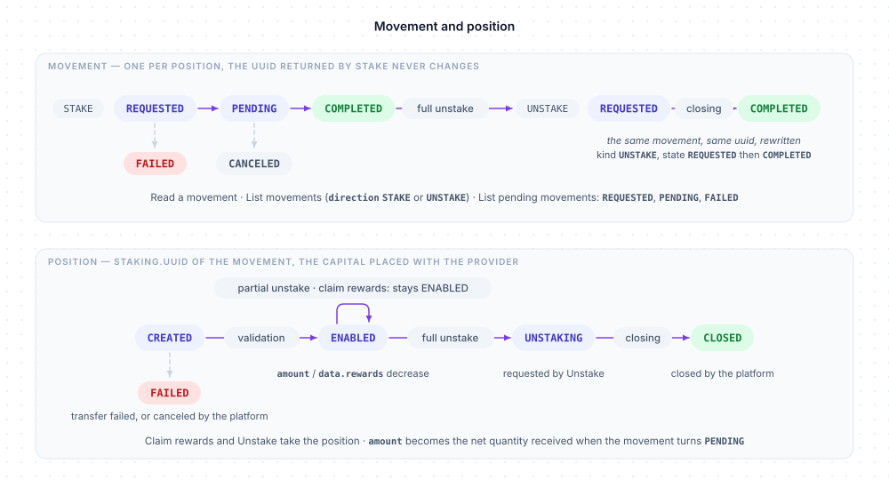

# Staking

Staking places the crypto of a customer with a staking provider to earn rewards. A **provider** is a `CoreType.STAKING` connector of the platform, one per asset (`figment_sol`, `bitgen_eth`…), with its own rate, minimum deposit and lock-up periods. Staking is driven by a **movement** — the request to stake, rewritten into the exit when the position is left entirely — attached to a **position**, the capital placed with the provider. `client.staking` lists the providers, opens a position, follows the movements, claims rewards, unstakes, and reads the operations and the EUR portfolio of a customer.

Two distinct identifiers: `stake` returns the uuid of a **movement**, which `get`, `list` and `movements` handle; the **position** it opened is `movement.staking.uuid`, which `rewards` and `unstake` take.

Examples use `client`, a configured `BitgenClient` ([Configuration](../configuration.md)). A customer is designated by a `UserRef`: their uuid, or a model carrying it, such as the `Created` returned by `client.customer.create` ([User references](../concepts.md#user-references)). A customer who is not an activated member of your organization is refused with `403 org_forbidden` ([Activation and identity](../concepts.md#activation-and-identity)).



## Methods

| Method | What it does | Returns |
|---|---|---|
| `providers(asset?)` | Lists the staking providers, for one asset or all | `Page<Core>` |
| `stake(user, params)` | Places crypto with a provider: opens a position | `Created` (the movement) |
| `list(params?)` | Lists the movements of your organization, all states | `Page<StakingMovement>` |
| `movements(params?)` | Lists the movements still in progress: `StakingMovementState.REQUESTED`, `PENDING`, `FAILED` | `Page<StakingMovement>` |
| `get(movement)` | Reads one movement and its position | `StakingMovement` |
| `rewards(position, params?)` | Claims the rewards of a position | `void` |
| `unstake(position, params?)` | Leaves a position, partially or entirely | `void` |
| `operations(user, params?)` | Lists the staking operations of a customer | `Page<StakingOperation>` |
| `portfolio(user)` | Reads the EUR balances and curves of a customer's staking | `StakingPortfolio` |

TypeScript types of this resource, exported by the package: `StakingPosition`, `StakingMovement`, `StakingOperation`, `StakingPortfolio`, `StakeParams`, `StakingListParams`, `StakingAmountParams` — the constants `StakingMovementState`, `StakingMovementKind`, `StakingPositionState` (also types) — plus the shared `UserRef`, `UserSummary`, `OrganizationSummary`, `AssetRef`, `AssetInput`, `Created`, `Amount`, `PageParams`, `Core`, `CoreRef`.

## Providers

```
client.staking.providers(asset?: AssetInput): Promise<Page<Core>>
```

A shortcut of `client.core.list({ type: CoreType.STAKING, asset })` ([Connectors](core.md)).

| Parameter | Type | Description |
|---|---|---|
| `asset` | `AssetInput` | Optional: only the providers of this asset, by uuid or ISO code (`Asset.SOL`) or by model ([Assets](../concepts.md#assets)) |

```ts
import { Asset, CoreState } from '@bitgen/sdk'

const { items: providers } = await client.staking.providers(Asset.SOL)

for (const provider of providers) {
  console.log(provider.name, provider.state === CoreState.ENABLED)   // 'figment_sol' true
}
```

Returns the `CoreType.STAKING` connectors, not paginated. The `uuid` or the `name` of a provider is the `provider` of `stake`. Its `config` describes the offer:

| Config field | Meaning |
|---|---|
| `connector` | The BITGEN connector |
| `apr` or `apy` | Annual rate, in % |
| `min_deposit` | Minimum deposit, in asset units |
| `deposit_locked_period` | Activation delay of a deposit |
| `rewards_locked_period` | Waiting period before a rewards withdrawal is paid |
| `unstake_locked_period` | Lock-up before an unstake is paid |
| `can_choose_withdrawal`, `can_choose_rewards` | Whether partial amounts are allowed (otherwise total only) |
| `min_rewards_eur` | Minimum EUR value of a rewards claim |

Periods are written `<unit>@<n>` with the unit `H`, `D`, `W`, `M` or `Y` — `D@3` is 3 days.

## Stake

```
client.staking.stake(user: UserRef, params: StakeParams): Promise<Created>
```

| Parameter | Type | Description |
|---|---|---|
| `params.asset` | `AssetInput` | The asset, by uuid or ISO code (`Asset.SOL`) or by model ([Assets](../concepts.md#assets)) |
| `params.amount` | `Amount` | The crypto quantity to stake, as a string, at least the provider's minimum deposit (`min_deposit` in its configuration, see `providers()`) — `422 amount_below_minimum` below it ([Amounts](../concepts.md#amounts)) |
| `params.provider` | `string` | The `uuid` or the `name` of a `CoreType.STAKING` connector of your organization (`providers`) |

```ts
import { Asset, StakingMovementState } from '@bitgen/sdk'

const { items: providers } = await client.staking.providers(Asset.SOL)

const { uuid: movementId } = await client.staking.stake('CUSTOMER_UUID', {
  asset: Asset.SOL,
  amount: '2',
  provider: providers[0].name,   // 'figment_sol'
})

const movement = await client.staking.get(movementId)
console.log(movement.state === StakingMovementState.REQUESTED)   // true
console.log(movement.staking.uuid)          // the position, for `rewards` and `unstake`
```

The amount is moved from the customer's custody wallet to the deposit address of the provider through an internal transfer: the errors of a custody withdrawal can surface ([Custody wallets › Errors](custody.md#errors)), in particular `416 requested_amount_error` for an insufficient crypto balance. Returns a `Created` — the uuid of the **movement**.

## List

```
client.staking.list(params?: StakingListParams): Promise<Page<StakingMovement>>
```

The movements of your organization, in every state.

| Parameter | Type | Description |
|---|---|---|
| `params.user` | `UserRef` | Only the movements of this customer (uuid or model; unknown → `404 unknown_user`) |
| `params.direction` | `StakingMovementKind` | Only this kind of movement: `StakingMovementKind.STAKE`, `UNSTAKE`, `WITHDRAW` or `REWARD` — absent, all. A movement is `STAKE`, then `UNSTAKE` after a full exit; `WITHDRAW` and `REWARD` match no movement — a partial exit and a claim create none — and give an empty page |
| `params.offset`, `params.limit` | `number` | [Pagination](../concepts.md#pagination) |

```ts
import { StakingMovementKind } from '@bitgen/sdk'

const { count, items } = await client.staking.list({ user: 'CUSTOMER_UUID', direction: StakingMovementKind.STAKE })
```

Returns a page of `StakingMovement` ([get](#get)).

## Movements

```
client.staking.movements(params?: StakingListParams): Promise<Page<StakingMovement>>
```

The movements still in progress: `StakingMovementState.REQUESTED`, `PENDING` and `FAILED` only. Same parameters as `list`.

```ts
const pending = await client.staking.movements({ user: 'CUSTOMER_UUID' })
```

Returns a page of `StakingMovement` ([get](#get)).

## Get

```
client.staking.get(movement: string | StakingMovement): Promise<StakingMovement>
```

`movement` is the uuid returned by `stake`, or a `StakingMovement`.

```ts
import { StakingMovementKind, StakingMovementState, StakingPositionState } from '@bitgen/sdk'

const movement = await client.staking.get('MOVEMENT_UUID')

console.log(movement.kind === StakingMovementKind.STAKE, movement.state === StakingMovementState.COMPLETED, movement.amount)   // true true '2'
console.log(movement.staking.state === StakingPositionState.ENABLED, movement.staking.data.rewards)   // true '0.0123'
```

Returns a `StakingMovement`:

| Field | Description |
|---|---|
| `uuid` | The movement |
| `state` | `StakingMovementState.REQUESTED`, `PENDING`, `COMPLETED`, `FAILED` or `CANCELED` — the cycle is below the table |
| `kind` | `StakingMovementKind.STAKE` from the request, `UNSTAKE` once a full exit is requested — the same movement, rewritten; `WITHDRAW` and `REWARD` are values of the `direction` filter and of the operations journal, carried by no movement |
| `provider` | The `name` of the staking connector (`figment_sol`) |
| `amount` | The quantity of the movement, as a string |
| `createdAt`, `updatedAt` | Epoch seconds |
| `staking` | The position (`StakingPosition`): `uuid`, `state` (`StakingPositionState.CREATED`, `ENABLED`, `UNSTAKING`, `CLOSED` or `FAILED`), `amount` (the net capital placed, as a string), `error` (failure reason when `FAILED`, `null` otherwise), `data` (`rewards`: rewards accrued and available, in asset units, as a string; `lastRewardAt`: epoch seconds of the last daily accrual — when available), `createdAt`, `updatedAt`, `core` (`CoreRef`: `{ uuid, name, label }`, the provider) |
| `owner` | `UserSummary`: `{ uuid, state, login, account: { firstname, lastname, fin } }` — the customer, a `UserRef` |
| `asset` | `AssetRef`: `{ uuid, iso, label }` |
| `organization` | `OrganizationSummary`: `{ uuid, state, name }`, or `null` |

A position has a single movement, whose uuid — the one returned by `stake` — never changes. The movement goes `STAKE` `REQUESTED` → `PENDING` (the deposit is on its way; the `amount` of the position becomes the net quantity received) → `COMPLETED` (the position is `ENABLED`); `REQUESTED` → `FAILED` when the transfer fails, `PENDING` → `CANCELED` when the platform cancels the request — the position is `FAILED` in both cases. A full exit (`unstake`) rewrites the same movement `UNSTAKE` `REQUESTED` (the position is `UNSTAKING`), then `COMPLETED` when the platform closes the position (`CLOSED`). A partial exit and a claim leave the movement untouched: the position stays `ENABLED`, its `amount` and `data.rewards` decrease.

An unknown movement, or one outside your organization, answers `404 unknown_staking_movement`.

## Rewards

```
client.staking.rewards(position: string | StakingPosition, params?: StakingAmountParams): Promise<void>
```

`position` is `movement.staking.uuid`, or `movement.staking` itself.

| Parameter | Type | Description |
|---|---|---|
| `params.amount` | `Amount` | Optional: the rewards to claim, as a string — absent, all of them; the EUR value must reach the provider's minimum (`min_rewards_eur`) — `422 amount_below_minimum` below it ([Amounts](../concepts.md#amounts)) |

```ts
const movement = await client.staking.get('MOVEMENT_UUID')

await client.staking.rewards(movement.staking)                      // all the rewards — the position, by model
await client.staking.rewards('POSITION_UUID', { amount: '0.01' })   // part of them, by uuid
```

The amount is deducted from the position immediately; the transfer is executed by compliance. No movement is created or changed: `data.rewards` of the position decreases, and the event `staking.claimed` reports the claim. Without rewards to claim the API answers `425 no_rewards`; a partial amount below the minimum of the provider, `422 amount_below_minimum`. The API answers with an empty body: the promise resolves with `undefined`.

## Unstake

```
client.staking.unstake(position: string | StakingPosition, params?: StakingAmountParams): Promise<void>
```

`position` is `movement.staking.uuid`, or `movement.staking` itself.

| Parameter | Type | Description |
|---|---|---|
| `params.amount` | `Amount` | Optional: the capital to withdraw from the position, as a string — absent, the whole position; a partial exit must reach the provider's minimum deposit — `422 amount_below_minimum` below it; a full exit (no amount) ignores it ([Amounts](../concepts.md#amounts)) |

```ts
const movement = await client.staking.get('MOVEMENT_UUID')

await client.staking.unstake('POSITION_UUID', { amount: '1' })   // partial exit, by uuid
await client.staking.unstake(movement.staking)                   // full exit — the position, by model
```

The amount is deducted from the position immediately; the transfer is executed by compliance. A full exit — no `amount`, or the whole position — rewrites the movement of the position: `kind` `UNSTAKE`, `state` `REQUESTED`, and the position is `UNSTAKING`; follow it with `get` and the uuid returned by `stake`; the event `staking.status` reports `UNSTAKING`, then `CLOSED` once the platform closes the position. A partial exit touches no movement: the position stays `ENABLED` with a reduced `amount`, and `staking.status` reports `WITHDRAWAL`. A full exit ignores the minimums; a partial amount below the minimum of the provider answers `422 amount_below_minimum`. The position must be past the lock-up period of the provider (`425 deposit_locked_period_not_elapsed`) and its staking movement completed (`412 staking_movement_not_completed`). The API answers with an empty body: the promise resolves with `undefined`.

## Operations

```
client.staking.operations(user: UserRef, params?: PageParams): Promise<Page<StakingOperation>>
```

| Parameter | Type | Description |
|---|---|---|
| `params.offset`, `params.limit` | `number` | [Pagination](../concepts.md#pagination) |

```ts
const { count, items } = await client.staking.operations('CUSTOMER_UUID', { offset: 0, limit: 50 })

for (const operation of items) {
  console.log(operation.date, operation.event, operation.amount, operation.value)   // 1701000000 'reward' '0.0123' 25.1
}
```

Returns a page of `StakingOperation`: `txId` (journal entry id), `movement` (uuid of the movement of the position — `reward` and `claim` entries carry it too — or `null`), `asset` (iso), `kind` (`StakingMovementKind.STAKE`, `UNSTAKE`, `WITHDRAW` or `REWARD` — `REWARD` for the `reward` and `claim` entries), `amount` (asset units, as a string), `price` (EUR price of the asset at that time), `value` (EUR value), `event` (`validated`, `failed`, `canceled`, `reward`, `claim` or `closed` — other values may appear), `provider` (connector name), `date` (epoch seconds). An unknown customer, or one outside your organization, answers `404 unknown_staking`.

## Portfolio

```
client.staking.portfolio(user: UserRef): Promise<StakingPortfolio>
```

```ts
const portfolio = await client.staking.portfolio('CUSTOMER_UUID')

console.log(portfolio.balances)             // { capital: 4060.2, revenues: 25.1 } — EUR
console.log(portfolio.histories.capital.m)  // EUR capital, one point per day over the last month
```

Returns a `StakingPortfolio`: `uuid`, `balances` (`{ capital, revenues }`, EUR), `histories` (`{ capital, revenues }`, two `History` curves — [Timestamps and histories](../concepts.md#timestamps-and-histories)). An unknown customer, or one outside your organization, answers `404 unknown_staking` — deliberately the same code, so that the answer reveals nothing.

## Errors

In addition to the [common errors](../errors.md#common-errors), and the custody withdrawal errors `stake` can surface ([Custody wallets › Errors](custody.md#errors)):

| Status | `code` | Meaning |
|---|---|---|
| `400` | `invalid_amount` | The amount is not valid |
| `403` | `org_forbidden` | The customer is not an activated member of your organization |
| `403` | `account_frozen` | The customer's account is frozen |
| `403` | `kyc_not_validated` | Your organization uses BITGEN's identity verification and the customer's identity is not validated ([Activation and identity](../concepts.md#activation-and-identity)) |
| `403` | `user_actions_disabled` | Customer actions are disabled for your organization (`user_can_actions` flag) |
| `404` | `unknown_user` | `stake`: unknown customer; `list`, `movements`: unknown `user` |
| `404` | `unknown_core` | `stake`: unknown `provider` |
| `404` | `unknown_asset` | Unknown asset |
| `404` | `unknown_organization` | The organization is unknown |
| `404` | `unknown_staking_movement` | `get`: unknown movement, or outside your organization |
| `404` | `unknown_staking` | `rewards`, `unstake`: unknown position — `operations`, `portfolio`: unknown customer, or outside your organization |
| `412` | `staking_connector_missing` | The provider has no connector that can be resolved |
| `412` | `staking_not_enabled` | The `CoreType.STAKING` connector of your organization is not enabled |
| `412` | `custody_not_enabled` | The `CoreType.CUSTODY` connector of your organization is not enabled |
| `412` | `staking_deposit_address_missing` | The provider has no deposit address |
| `412` | `staking_movement_not_completed` | `unstake`: the staking movement is not completed yet |
| `416` | `amount_precision_exceeded` | More decimals than the asset allows |
| `416` | `insufficient_rewards` | `rewards`: not enough rewards for the amount |
| `416` | `insufficient_balance` | `unstake`: not enough capital for the amount |
| `422` | `amount_below_minimum` | The amount is below the minimum of the provider (`min_deposit` on `stake`, a partial amount on `rewards` / `unstake`) |
| `422` | `staking_not_active` | The position is not active |
| `423` | `blocked_by_alert` | An active compliance alert blocks the customer |
| `424` | `token_price_unavailable` | `rewards`: no price is available for the token |
| `425` | `no_rewards` | `rewards`: nothing to claim |
| `425` | `no_balance` | `unstake`: nothing to withdraw |
| `425` | `deposit_locked_period_not_elapsed` | `unstake`: the lock-up period of the deposit has not elapsed |

## Related

- [Connectors](core.md) — the `CoreType.STAKING` connectors, their `config`
- [Custody wallets](custody.md) — the wallet the staked amount is taken from
- [Amounts](../concepts.md#amounts) — crypto amounts as strings, minimums
- [Webhooks](webhooks.md) — `staking.requested`, `staking.status`, `staking.rewards`, `staking.claimed`
